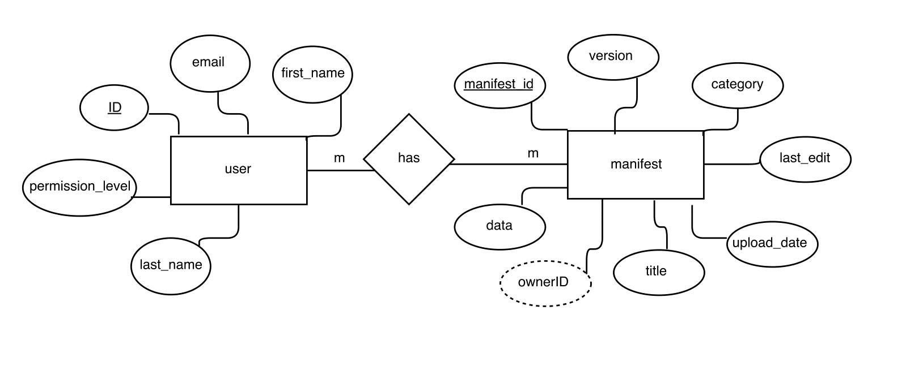

###Tables and their data:

Current Iteration of ERD:

###Classes

user: {
  
  first_name: string
  
  last_name: string
  
  email: string
  
  ID (internal tracking ID): int
  
  permission_level: int
  
  }
  
Manifest: {

  ID: int
  
  version : int
  
  category: enum
  
  last_edit: date
  
  upload_date: date
  
  title: sting
  
  ownderID: int (match userId)
  
  data: string (this will be a file path to the file on our server)
  
  }
 
 User-Owns_manifest {
 
  userID: int
  
  manifestID: int
  
  upload_date: date
  
  last_edit: date
 
 }
